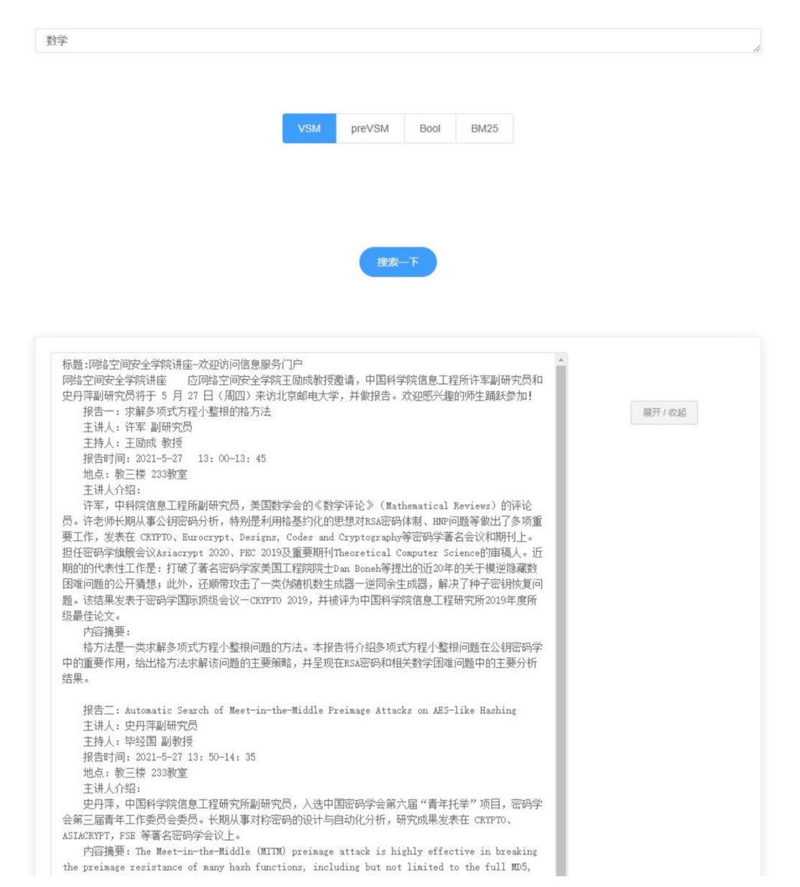

# Information-Retrieval-Framework

A generic information retrival framework.

---
## ✔Getting Started

### Requirements
- lxml
- urllib
- bs4

---
## 👀Notice
More details can be found [here](https://github.com/HYTYH/Information-Retrival-Framework/blob/main/docs/InformationRetrievalFramework_doc.pdf)

---

## 🖼Runtime Screenshot

---

## ✉Contact Us

Feel free to open an issue if you have any questions about our project.
